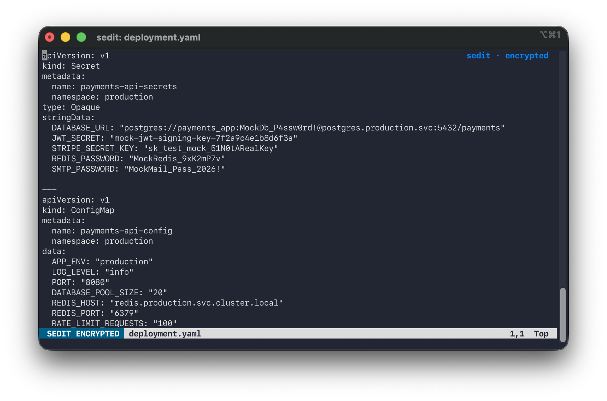

<p style="float: right">
  
</p>

# secure-edit

Edit a passphrase-encrypted text file with your normal editor.

secure-edit a.k.a.`sedit` is a stronger take on `vim -x`: it uses authenticated encryption, so a
wrong password is rejected **before** the editor opens, and any tampering with
the file is detected.


<p align="center">
  
</p>

## Features

- **Strong encryption:** XChaCha20-Poly1305 with a key derived from your
  passphrase by Argon2id (3 passes, 256 MiB, 4 threads).
- **Wrong password fails:** the file is authenticated and decrypted before the
  editor launches. No more editing garbage.
- **Tamper detection:** the whole file header, including the KDF parameters, is
  authenticated.
- **Your editor:** uses `$SEDIT_EDITOR`, then `$VISUAL`, then `$EDITOR`, then
  `vim` (or `vi`). Graphical editors set in `$VISUAL` or `$EDITOR` are ignored,
  because they keep plaintext copies (see [Choosing an editor](#choosing-an-editor)).
  The editor is given a temp file named after your real file, so it shows the
  right name and picks the right syntax highlighting.
- **Vim protections and cues:** for vi, vim and nvim, `sedit` disables swap,
  backup, undo and viminfo files so plaintext isn't leaked, sets the terminal
  title to `sedit: FILE`, and shows a blue `SEDIT ENCRYPTED` banner in the status
  line so you can tell you are in a sedit session. A small `sedit · encrypted`
  watermark sits at the right of the first line (virtual text, so it is never
  saved in the file; it needs vim 9.0.0067 or newer, or neovim). The banner
  replaces your own status line for that session, and plugins can't remove it.
  Turn the banner and watermark off with `SEDIT_STATUSLINE=0`.
- **Clear confirmation:** when the editor exits, `sedit` says what happened, for
  example `sedit: saved notes.txt (encrypted; password from Keychain)`, so you
  know the file was encrypted and where the password came from. Messages go to
  stderr, so `sedit -p FILE | ...` output is unaffected.
- **Safe saves:** written atomically (temp file, fsync, rename). If the editor
  exits with an error, or you make no changes, the file is left untouched.
- **Sharing:** `sedit --share` writes a copy encrypted to someone's age or SSH
  public key, which they can read with the standard `age` tool and no `sedit`.
  `sedit --import` turns such a file (or any age file) into a `sedit` file.
- **Previous version kept:** each save keeps the old version, still encrypted,
  as `FILE.bak`.
- **Optional Keychain support (macOS, opt-in):** remember a file's password in
  the login keychain so you don't retype it. Off by default; see
  [Remembering passwords](#remembering-passwords-macos-keychain) for the
  security trade-off.
- **Concurrent-edit protection:** a lock prevents two `sedit` processes from
  editing the same file at once.

## Install

### From a release

Download the tarball for your platform (macOS or Linux, arm64 or amd64) from the
[Releases page](https://github.com/eddienko/secure-edit/releases), check it
against `SHA256SUMS`, and put `sedit` somewhere on your `PATH`:

```sh
shasum -a 256 -c --ignore-missing SHA256SUMS
tar -xzf sedit_v1.0.0_darwin_arm64.tar.gz
mv sedit_v1.0.0_darwin_arm64/sedit /usr/local/bin/
sedit --version
```

The binaries are not code-signed or notarized. If macOS refuses to open one
downloaded in a browser ("cannot be opened because the developer cannot be
verified"), clear the quarantine flag with `xattr -d com.apple.quarantine sedit`,
or build from source instead. Releases are built by a GitHub Actions workflow
when a `v*` tag is pushed.

### From source

Requires Go 1.26 or newer (an older Go with `GOTOOLCHAIN=auto`, the default,
downloads it automatically).

With `go install`, which puts `sedit` in `$(go env GOBIN)` (default `~/go/bin`):

```sh
go install github.com/eddienko/secure-edit/cmd/sedit@latest
```

Or from a clone:

```sh
git clone https://github.com/eddienko/secure-edit.git
cd secure-edit
go build -o sedit ./cmd/sedit
# optionally: mv sedit /usr/local/bin/
```

## Usage

```
sedit FILE                      edit FILE (created if it doesn't exist or is empty)
sedit -p FILE                   decrypt FILE to stdout
sedit --passwd FILE             change FILE's password
sedit --encrypt [-y] FILE       encrypt an existing plaintext FILE in place
sedit --share FILE --to KEY     write a copy of FILE for someone else (see below)
sedit --import FILE.age -i KEY  turn an age-encrypted file into a sedit file
sedit --remember FILE           edit FILE and save its password in the macOS Keychain
sedit --forget FILE             remove FILE's password from the Keychain
sedit --set-default             store a default password in the macOS Keychain
sedit --forget-default          remove the default password
sedit -h, --help                show usage
sedit --version                 show the version
```

If `FILE` is a symlink, `sedit` follows it: the file it points to is edited,
locked and backed up, and the link itself is left alone.

`--default` or `--custom` can be added to `FILE`, `--passwd` and `--encrypt` to
choose the password for a new file without being asked (see
[Default password](#default-password-macos-keychain)).

```sh
sedit secrets.enc            # prompts for a password, opens $EDITOR
sedit -p secrets.enc | grep api
sedit --passwd secrets.enc
```

For a new file you are asked for the password twice. An empty password is
rejected.

### Choosing an editor

`sedit` picks the editor from `$SEDIT_EDITOR`, then `$VISUAL`, then `$EDITOR`,
then `vim` (or `vi` if vim isn't installed). Setting `SEDIT_EDITOR` is the way to
use a different editor for `sedit` than for everything else:

```sh
export SEDIT_EDITOR=vim
```

**Graphical editors are ignored by default.** If `$VISUAL` or `$EDITOR` names VS
Code (`code`, `code-insiders`, `codium`), Cursor, Windsurf, Zed, Sublime Text
(`subl`), Atom, TextMate (`mate`) or BBEdit, `sedit` skips it and tells you:

```
sedit: ignoring VISUAL=code (graphical editors keep plaintext copies); using vim. Set SEDIT_EDITOR to override.
```

The reason is that these editors keep their own history and backup stores
outside `sedit`'s control (VS Code's Local History and hot-exit backups, for
example), which can hold plaintext copies of every version you save. They also
don't fit well with `sedit`: the vim-only extras (title, banner, watermark)
don't apply.

**To use one anyway**, say so explicitly: `SEDIT_EDITOR=code sedit FILE`. Many
graphical editors hand the file to an already running app and **exit
immediately**, which would make `sedit` think you are done: it would find the
file unchanged and delete its temp file while the editor still shows it. For the
editors above `sedit` adds `--wait` for you (so this runs `code --wait`) and
reminds you about the plaintext copies. For any other editor, make the command
wait yourself (look for a `--wait` or `-w` option). If an editor exits within a
second without changing the file, `sedit` warns that it may have detached.

Terminal editors such as nano and emacs are used as they are. Only vim, vi and
nvim get the leak protections described above.

### Environment variables

| Variable             | Effect                                                         |
|----------------------|----------------------------------------------------------------|
| `SEDIT_EDITOR`       | The editor to run, taking priority over `VISUAL` and `EDITOR`. The only way to use a graphical editor. |
| `VISUAL`, `EDITOR`   | The editor to run if `SEDIT_EDITOR` is unset (`VISUAL` first). Graphical editors here are ignored. Default: `vim`, else `vi`. |
| `SEDIT_STATUSLINE`   | Set to `0` (or `false`, `no`, `off`) to turn off the vim banner: the `SEDIT ENCRYPTED` status line banner and the watermark on the first line. Your own status line is left alone. The terminal title and the leak protections stay on. |

To make the opt-out permanent, put `export SEDIT_STATUSLINE=0` in your shell
profile. Anything else, or leaving it unset, keeps the banner.

### Converting an existing plaintext file

`sedit` refuses to open a file that isn't a sedit file, and says so before asking
for a password. This protects you from typos like `sedit .bashrc`. To encrypt an
existing plaintext file deliberately:

```sh
sedit --encrypt notes.txt      # asks for confirmation, then a new password
sedit --encrypt -y notes.txt   # skip the confirmation (required without a terminal)
```

It refuses files that are already encrypted or empty. An empty file needs no
conversion: `sedit FILE` treats it as new. No `.bak` is created, because it would
be a plaintext copy. See the limitations below about the old plaintext.

### Sharing a file with someone

A `sedit` file can only be opened with its password. To give someone a copy they
can read without knowing it, encrypt a copy to their public key using
[age](https://age-encryption.org):

```sh
sedit --share secrets.txt --to age1ql3z7hjy54pw3hyww5ayyfg7zqgvc7w3j2elw8zmrj2kg5sfn9aqmcac8p
sedit --share secrets.txt --to "ssh-ed25519 AAAA... alice@laptop"
sedit --share secrets.txt -R alice.pub -R bob.pub -o for-the-team.age
```

`sedit` decrypts the file in memory and writes the copy, so the plaintext never
touches the disk and no editor is involved. The recipient decrypts it with the
ordinary `age` command and doesn't need `sedit`:

```sh
age -d -i ~/.ssh/id_ed25519 secrets.txt.age      # with their SSH key
age -d -i key.txt secrets.txt.age                # with an age key
```

| Option | Meaning |
|--------|---------|
| `--to KEY` | A recipient's public key: an age key (`age1...`, or a post-quantum `age1pq1...`) or an SSH public key (`ssh-ed25519`, `ssh-rsa`). Repeat it for several recipients. |
| `-R FILE` | A file of public keys, one per line (`#` comments and blank lines are ignored). An SSH `.pub` file works as it is. May be repeated. |
| `-o OUT` | Where to write the copy. Default: `FILE.age` next to the original. `-o -` writes to stdout. An existing `OUT` is replaced. |
| `-a`, `--armor` | Write text (ASCII armor) instead of binary, for pasting into an email or chat. Binary output to a terminal is refused. |

Things to know:

- **It is a snapshot, in one direction.** The recipient gets a copy of the
  contents as they are now. Their changes don't come back, and later changes of
  yours don't reach them. Share again to send an update.
- **Check the key.** Make sure the public key really belongs to the person, for
  example by confirming it with them over another channel. `sedit` can't know.
- **You can't take it back.** Anyone who has the copy and their key can read it,
  for as long as they keep it.
- **No mixing post-quantum and classic keys.** `age` refuses a file addressed to
  both kinds, so give either `age1pq1...` keys only, or classic keys only.
- **Not supported:** `age` plugin recipients (`age1yubikey...`, which need an
  external program) and tagged recipients. Private keys are rejected, and are
  never echoed back.
- `--share` never overwrites the `sedit` file it reads from, even through a
  symlink or hard link, and it leaves the original untouched.
- After sharing, the recipient's copy is only as private as their key and their
  machine. The copy decrypts to plain text on their side.

### Importing a shared file

The other direction: if someone sent you a file encrypted with age (for example
made by `sedit --share`), `--import` turns it into a `sedit` file under a password
of your choosing, so you can keep editing it with `sedit`:

```sh
sedit --import secrets.txt.age -i ~/.ssh/id_ed25519    # writes ./secrets.txt
sedit --import message.age -i key.txt -o notes/message.txt
sedit --import team-notes.age                          # passphrase-encrypted file
```

It decrypts in memory and asks you for the new password (or use `--default` or
`--custom`, as for a new file). The plaintext never touches the disk.

| Option | Meaning |
|--------|---------|
| `-i KEY` | Your private key: an age key file (`AGE-SECRET-KEY-...` or a post-quantum `AGE-SECRET-KEY-PQ-...`) or an SSH private key. May be repeated. A passphrase-protected SSH key is fine: you are asked for its passphrase, but only if the file is actually addressed to that key. |
| *(no `-i`)* | The file must be passphrase-encrypted (`age -p`); you are asked for the passphrase. |
| `-o OUT` | Where to write the `sedit` file. Default: the input name without `.age`. If the input doesn't end in `.age`, `-o` is required. |

Things to know:

- **It never overwrites anything.** If `OUT` already exists (including a
  symlink), `sedit` stops and tells you. It also refuses to write over the file it
  is reading.
- **Nothing is written on failure.** A wrong key or passphrase, a truncated or
  tampered file, or a file that isn't an age file at all, all stop before the new
  password is even asked for.
- It works on any age file, not just ones from `sedit --share`. Armored (text)
  files are detected automatically.
- The input is read from a file, not from stdin, and is limited to 256 MiB.
- Plugin identities (such as hardware keys) aren't supported.
- The original `.age` file is left as it is. It stays readable by anyone who has
  the key, so delete it if you no longer need it.

### Remembering passwords (macOS Keychain)

On macOS you can opt in to storing a file's password in your login keychain:

```sh
sedit --remember secrets.enc   # prompts once, then stores the password
sedit secrets.enc              # no prompt from now on (also works with -p, --passwd)
sedit --forget secrets.enc     # remove it again
```

Nothing is stored unless you pass `--remember`. If a stored password stops
working (for example the file was re-keyed elsewhere), `sedit` removes it and
asks you to type the password. `--passwd` keeps an existing stored entry up to
date. Entries are keyed by the file's absolute path, so moving or renaming the
file means running `--remember` again. The file format is unchanged: a file can
always be opened by typing its password, on any platform.

**This weakens your security, so be aware of what you are trading.**

- The password is stored using the `/usr/bin/security` tool, which is trusted on
  the items it creates. While your login keychain is unlocked (normally whenever
  you are logged in), **any program running as your user can read the password
  without a prompt**, for example with
  `security find-generic-password -s sedit -a /path/to/file -w`. That includes
  malware and malicious scripts you run by accident.
- There is no Touch ID or password prompt per use. Doing that properly would need
  a code-signed binary with keychain entitlements, which this project
  deliberately doesn't require.
- So the practical protection of a remembered file becomes "whoever is logged in
  as you", not "whoever knows the passphrase". The encryption itself is just as
  strong; the passphrase is what's exposed.
- The login keychain file (`~/Library/Keychains/login.keychain-db`) is included
  in ordinary backups such as Time Machine, and it is protected by your login
  password.
- The password is passed to `security` through stdin, so it does not appear in the
  process list, and is base64-encoded in the keychain, which is encoding, not
  protection.

Use it for convenience on a machine you trust. Don't use it for files where the
passphrase is the only thing standing between an attacker with your account and
the contents. On other platforms `--remember` and `--forget` report that they
aren't supported.

**Cleaning up stale entries.** A stored password that no longer opens its file is
removed automatically the next time you use that file. But if you **move, rename
or delete** a file you had remembered, nothing notices: its entry stays in the
keychain, still holding a working password that any program running as you can
read. `sedit` can't list its entries, so clean them up yourself:

```sh
sedit --forget /old/path/to/secrets.enc
```

This works when the path has no symlinked directories in it. Entries are stored
under the fully resolved path, which `sedit` can only work out for a file that
still exists. If it says "no stored password" for a path you know was
remembered, give it the fully resolved path instead (for example
`/private/tmp/...` rather than `/tmp/...`):

```sh
sedit --forget /private/tmp/old/secrets.enc
```

You can also delete an entry directly with the `security` tool:

```sh
security delete-generic-password -s sedit -a /resolved/path/to/secrets.enc
```

Or open **Keychain Access**, search for `sedit`, and delete the entries you no
longer need. The default password is stored under the account name `<default>`.

### Default password (macOS Keychain)

For a mix of convenience files and sensitive files, you can store one **default**
password and decide per file whether to use it:

```sh
sedit --set-default            # prompts for the default password, stores it
sedit notes.enc                # new file: asks "[d]efault or [c]ustom?"
sedit --default todo.enc       # new file with the default, no questions
sedit --custom bank.enc        # new file with its own password
sedit --passwd --custom todo.enc    # move a file off the default
sedit --forget-default
```

- **Creating a file.** If a default exists and you are at a terminal, you are
  asked whether the new file uses the default or a custom password. Without a
  terminal (a script) and without a flag, a custom password is used, so the
  default is never picked up by accident. `--default` fails if none is set.
  `--passwd` and `--encrypt` work the same way for the new password.
- **Opening a file.** `sedit` tries, in order: the file's own entry (from
  `--remember`), the default, then a prompt. A file with a custom password just
  fails the default attempt silently and prompts. That costs one extra key
  derivation (roughly a third of a second with the current settings).
- **The default is never removed automatically**, because many files rely on it.
  Per-file entries still are (see above).
- **Changing the default does not re-key your files.** Files created with the
  previous default still need the previous password. `--set-default` reminds you
  when it replaces an existing one.
- **Files don't record which kind they are.** A sensitive file whose password
  happens to equal the default will open silently, so give sensitive files a
  different password and create them with `--custom`.

The security trade-offs of the previous section apply, with a larger blast
radius: any program running as you can read the default and it opens **every**
file that uses it.

### Restoring the previous version

```sh
sedit -p secrets.enc.bak     # inspect it (same password)
mv secrets.enc.bak secrets.enc
```

Only one previous version is kept; each save overwrites `FILE.bak`.

### Scripting

When stdin is not a terminal, passwords are read as lines from stdin, one per
prompt:

```sh
echo "$PASSWORD" | sedit -p secrets.enc
printf '%s\n%s\n' "$OLD" "$NEW" | sedit --passwd secrets.enc   # current, then new
```

No confirmation prompt is shown in that mode. Beware that passwords in shell
variables, history and process lists are visible to other tools.

## File format

All integers are big endian.

| Field      | Size | Notes                              |
|------------|------|------------------------------------|
| magic      | 6    | `SEDIT\0`                          |
| version    | 1    | currently `1`                      |
| time       | 4    | Argon2id iterations                |
| memory     | 4    | Argon2id memory in KiB             |
| threads    | 1    | Argon2id parallelism               |
| salt       | 16   | random, fresh on every save        |
| nonce      | 24   | random, fresh on every save        |
| ciphertext | n+16 | XChaCha20-Poly1305, includes tag   |

The header (magic through nonce) is passed as associated data. KDF parameters in
a file are bounded on read, so a hostile file can't force huge allocations.

## Limitations

Read these before relying on `sedit`. It protects data **at rest**. It does not
defend against malware or an attacker on your machine while the file is open.

- **Plaintext temp file.** While you edit, the plaintext sits in a `0700` temp
  directory. It is zeroed and deleted afterwards, but on macOS the temp
  directory is on disk, not RAM, so the data may have reached the SSD. Zeroing
  can't guarantee otherwise. Using a RAM disk is a stronger option.
- **Other editors may leak.** Leak protection is built in for vi, vim and nvim
  only. Editors such as VS Code, Emacs and nano may write backup, swap or
  recovery files, so configure them yourself. Graphical editors are the worst
  case: VS Code, for example, keeps its own Local History and hot-exit backups,
  which can hold plaintext copies of every version you save. That is why `sedit`
  ignores them unless you set `SEDIT_EDITOR`. A terminal editor with leak
  protection (vim) is the safer choice for secrets.
- **Memory is not locked or reliably wiped.** Go's garbage collector can leave
  copies of the password and plaintext in memory, and memory may be swapped.
- **Your passphrase is the weak point.** Argon2id slows brute force, but a weak
  passphrase is still weak.
- **No integrity beyond one file.** A wrong password and a corrupted file give
  the same error (`wrong password or corrupted file`), by design.
- **`FILE.bak` keeps the old password.** After `--passwd`, an existing `.bak` is
  still encrypted with the *old* password. `sedit` warns you but doesn't delete
  it. Remove it yourself if the old password was compromised.
- **Converted plaintext isn't erased.** After `--encrypt`, the original plaintext
  may remain in freed disk blocks, backups, Time Machine snapshots or editor
  files. Treat the old contents as exposed, and rotate any credentials in it.
- **Remembered and default passwords are readable by any process running as
  you.** See [Remembering passwords](#remembering-passwords-macos-keychain) and
  [Default password](#default-password-macos-keychain). A leaked default opens
  every file that uses it. Only use these where that is acceptable.
- **Single backup generation.** Only the immediately preceding version is kept.
- **Lock file is advisory and local.** The lock is an `flock` on `.FILE.lock`,
  which is left on disk (empty) after exit. It is released automatically if
  `sedit` crashes. It may be unreliable on some network filesystems such as NFS,
  and it does not protect copies of the file elsewhere. `sedit -p` doesn't take
  the lock, which is safe because saves are atomic renames.
- **Unix only.** The lock uses `syscall.Flock`, so it won't build on Windows.
- **No recovery.** There is no password reset. Lose the passphrase and the data
  is gone.
- **Not independently audited.** It uses standard primitives from
  `golang.org/x/crypto` and no custom cryptography, but the program as a whole
  hasn't had a security review.

## Development

```sh
go vet ./...
go test ./...
```

### Publishing a new version

Releases are built by [`.github/workflows/release.yml`](.github/workflows/release.yml)
whenever a tag starting with `v` is pushed. To publish one:

1. Make sure everything is committed and pushed to `main`, and that the tests
   pass locally:

   ```sh
   go vet ./... && go test ./...
   ```

2. Pick the next version number using [semantic versioning](https://semver.org):
   `vMAJOR.MINOR.PATCH`. Bump PATCH for fixes, MINOR for new features, and MAJOR
   for incompatible changes (including changes to the file format).

3. Tag the commit and push the tag:

   ```sh
   git tag -a v1.2.3 -m "sedit v1.2.3"
   git push origin v1.2.3
   ```

4. Watch the run on the repository's **Actions** tab. It runs `go vet` and the
   tests on Linux and macOS, then builds tarballs for macOS and Linux (arm64 and
   amd64), writes `SHA256SUMS`, and creates the GitHub release with generated
   notes. You can edit the notes afterwards on the release page.

A tag containing a hyphen, such as `v1.3.0-rc1`, is published as a pre-release.

To try the build without publishing anything, run the same script locally. It
writes the tarballs and checksums to `dist/` (git-ignored):

```sh
scripts/build-release.sh v0.0.0-test
```

The version printed by `sedit --version` comes from the tag. Don't reuse or move
a tag that has been published: the Go module proxy caches versions permanently,
so a moved tag causes checksum errors for anyone who already fetched it. Publish
a new version instead.

## License

[MIT](LICENSE) © 2026 Eduardo Gonzalez Solares
